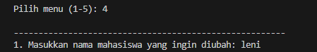

# Aplikasi Manajemen Data Mahasiswa

NAMA : LENI

NIM : 312410442

## Flowchart


## Deskripsi Proyek
Aplikasi manajemen data mahasiswa adalah program Python sederhana yang memungkinkan pengguna untuk melakukan operasi dasar pada data mahasiswa, seperti menambah, menampilkan, menghapus, dan mengubah data.

## Fitur Utama
- Tambah data mahasiswa baru
- Tampilkan seluruh data mahasiswa
- Hapus data mahasiswa
- Ubah data mahasiswa (nama dan nilai)

## Algoritma Program

### Struktur Data
Program menggunakan struktur data `list` untuk menyimpan data mahasiswa, dimana setiap mahasiswa direpresentasikan sebagai `dictionary` dengan dua kunci:
- `'nama'`: Menyimpan nama mahasiswa
- `'nilai'`: Menyimpan nilai mahasiswa

### Alur Algoritma Utama
1. **Inisialisasi**
   - Membuat list kosong `mahasiswa` untuk menyimpan data

2. **Fungsi Tambah Data**
   - Menerima input nama dan nilai
   - Membuat dictionary baru dengan data mahasiswa
   - Menambahkan dictionary ke list `mahasiswa`

3. **Fungsi Tampilkan Data**
   - Memeriksa apakah list `mahasiswa` kosong
   - Jika tidak kosong, iterasi dan tampilkan setiap data mahasiswa
   - Jika kosong, tampilkan pesan "Tidak ada data mahasiswa"

4. **Fungsi Hapus Data**
   - Menerima nama mahasiswa yang akan dihapus
   - Gunakan list comprehension untuk membuat list baru tanpa mahasiswa tersebut
   - Update list `mahasiswa`

5. **Fungsi Ubah Data**
   - Menerima nama lama, nama baru, dan nilai baru
   - Cari mahasiswa berdasarkan nama lama
   - Ubah nama dan nilai mahasiswa yang sesuai

6. **Menu Utama**
   - Tampilkan pilihan menu
   - Terima input pengguna
   - Jalankan fungsi sesuai pilihan
   - Lakukan perulangan sampai pengguna memilih keluar

## Struktur Kode

### Variabel Global
```python
mahasiswa = []  # List untuk menyimpan data mahasiswa
```

### Fungsi-Fungsi Utama

#### `tambah(nama, nilai)`
- Parameter: nama mahasiswa dan nilai
- Menambahkan dictionary mahasiswa ke list
- Contoh: `tambah("leni", 95)`

#### `tampilkan()`
- Menampilkan seluruh data mahasiswa
- Menangani kasus list kosong
- Mencetak nama dan nilai setiap mahasiswa

#### `hapus(nama)`
- Parameter: nama mahasiswa yang akan dihapus
- Menggunakan list comprehension untuk menyaring data
- Membuat list baru tanpa mahasiswa yang dimaksud

#### `ubah(nama_lama, nama_baru, nilai_baru)`
- Parameter: nama lama, nama baru, dan nilai baru
- Mencari mahasiswa dengan nama lama
- Memperbarui nama dan nilai mahasiswa

#### `menu()`
- Fungsi utama untuk menjalankan program
- Loop tak terbatas menampilkan pilihan menu
- Menerima dan memproses input pengguna
- Memanggil fungsi sesuai pilihan

## Contoh Penggunaan

### Menambahkan Data Mahasiswa


## Output


Fitur ini digunakan untuk menambah data Mahasiswa berupa nama dan nilai.

### Menampilkan Data Mahasiswa


## Output


Fitur ini digunakan untuk menampilkan Data mahasiswa yamg telah tersimpan.

### Hapus Data Mahasiswa


## Output


Fitur ini digunakan untuk menghapus nama mahasiswa yang telah tersimpan dengan cara mengetik nama mahasiswa yang ingin dihapus.

### Ubah Data



## Output


Fitur ini digunakan untuk mengubah nama mahasiswa yang telah tersimpan dengan cara mengetik nama mahasiswa yang ingin diubah.

### keluar


Fitur ini digunakan untuk mengakhiri program.


## Persyaratan
- Python 3.x

## Cara Menjalankan
```bash
python kode_manajemen.py
```

**LENI**

**NIM: 312410442**


